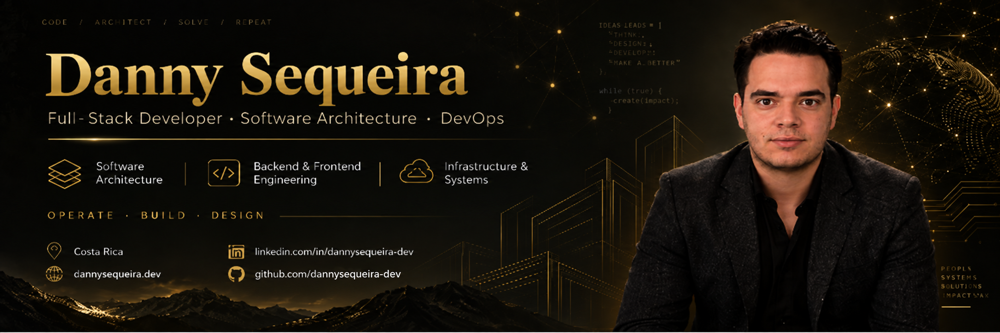

<div align="center">



<br />

# Danny Sequeira

### Full-Stack Developer · Software Architecture · DevOps

**OPERATE · BUILD · DESIGN**

Building scalable software, designing robust systems, and shipping things that actually work.

<br />

<a href="https://dannysequeira.dev">
  
</a>
<a href="https://www.linkedin.com/in/dannysequeira-dev/">
  
</a>
<a href="https://www.instagram.com/dannysequeira.dev/">
  
</a>

<br /><br />


</div>

---

## 👋 About me

I'm **Danny Sequeira**, a software developer from 🇨🇷 **Costa Rica**.

I've been building software since I was 15, working across frontend, backend, infrastructure, and system architecture.

Today, I spend most of my time designing and building **production-grade applications**, exploring better ways to structure complex systems, and turning ideas into maintainable software.

My interests live somewhere between:

**Software Architecture · Domain-Driven Design · Distributed Systems · DevOps · Developer Experience**

I enjoy understanding not only **how to make something work**, but also **how it should be designed, deployed, monitored, and evolved over time**.

```text
Think → Design → Build → Operate → Improve
```

---

## ⚡ What I do

### 🏗️ Design

I like thinking about systems before thinking about frameworks.

Architecture, domain boundaries, APIs, data flows, scalability, maintainability, and the trade-offs behind technical decisions.

### 💻 Build

From interactive web applications to backend services and distributed systems.

My main environment revolves around **Java / Spring** and **TypeScript**, with React and Next.js on the frontend.

### ⚙️ Operate

Software doesn't end at `git push`.

I enjoy working with containers, CI/CD, Linux servers, observability, networking, deployment automation, and production infrastructure.

---

## 🛠️ Tech stack

<div align="center">

### Languages


&nbsp;

&nbsp;

&nbsp;

&nbsp;


<br /><br />

### Backend & Architecture


&nbsp;

&nbsp;


<br /><br />

### Frontend


&nbsp;

&nbsp;

&nbsp;


<br /><br />

### Data & Infrastructure


&nbsp;

&nbsp;

&nbsp;

&nbsp;

&nbsp;


<br /><br />

### Tools


&nbsp;

&nbsp;

&nbsp;

&nbsp;


</div>

---

## 🚀 Selected work

<table>
<tr>
<td width="33%" valign="top">

### Sports Pro

Production sports platform built around modern frontend and backend systems.

Focused on maintainability, domain modeling, scalable architecture, and the continuous evolution of a real-world product.

</td>
<td width="33%" valign="top">

### OSS

Maintenance and inventory management platform.

Architecture redesigned from a traditional MVC approach into a client-server system powered by **Next.js, Java, and distributed services**.

</td>
<td width="33%" valign="top">

### Krypto

Modern cryptocurrency-focused web experience built around strong visual design, responsiveness, and frontend engineering.

</td>
</tr>
</table>

<div align="center">

**More projects, case studies, and technical writing → [dannysequeira.dev](https://dannysequeira.dev)**

</div>

---

## ✍️ Writing & ideas

I also write about software engineering and the decisions behind the code.

Topics usually include **architecture, microservices, networking, infrastructure, AI, software design, and lessons learned while building real systems**.

<div align="center">

### [Read the blog →](https://dannysequeira.dev)

</div>

---

## 📊 GitHub

<div align="center">


<br />


</div>

---

<div align="center">

## Let's build something meaningful.

Software should do more than compile.

It should be understandable, maintainable, observable, and built with intention.

<br />

**[dannysequeira.dev](https://dannysequeira.dev)**

<br />

<sub>Designed & built by Danny Sequeira · Costa Rica 🇨🇷</sub>

</div>
